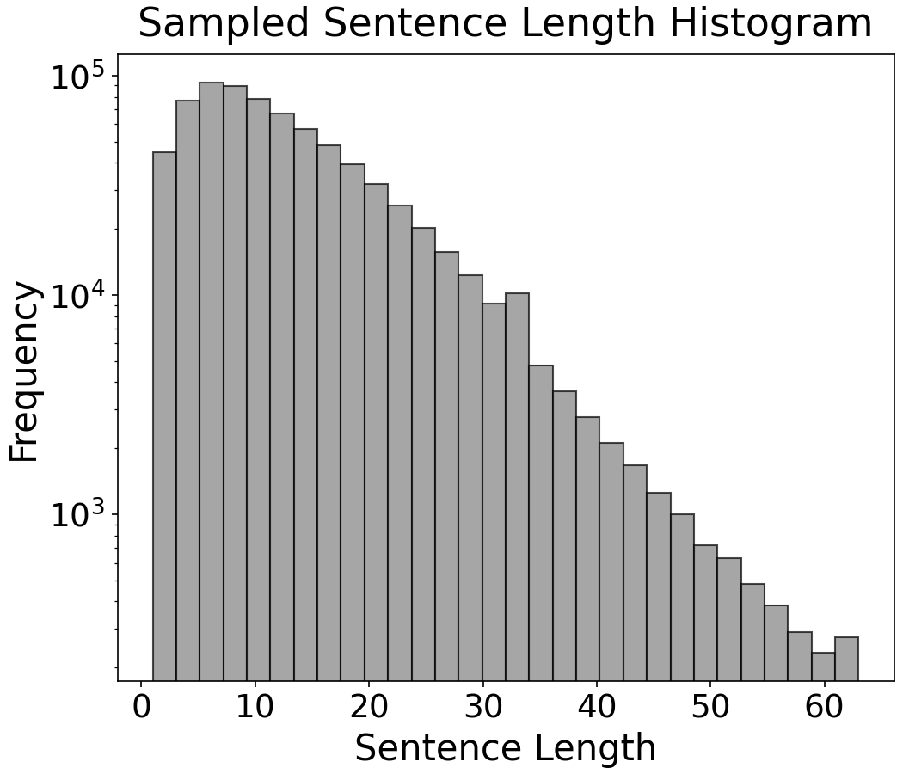
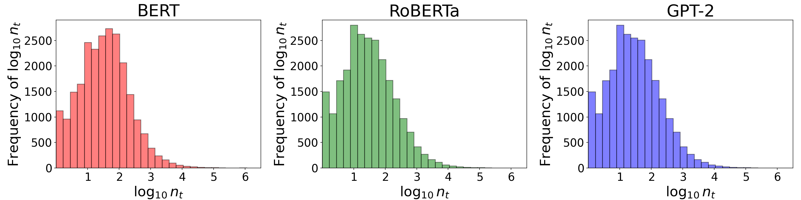
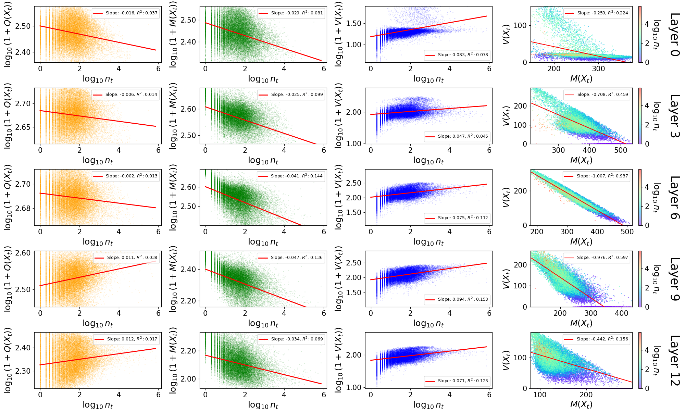
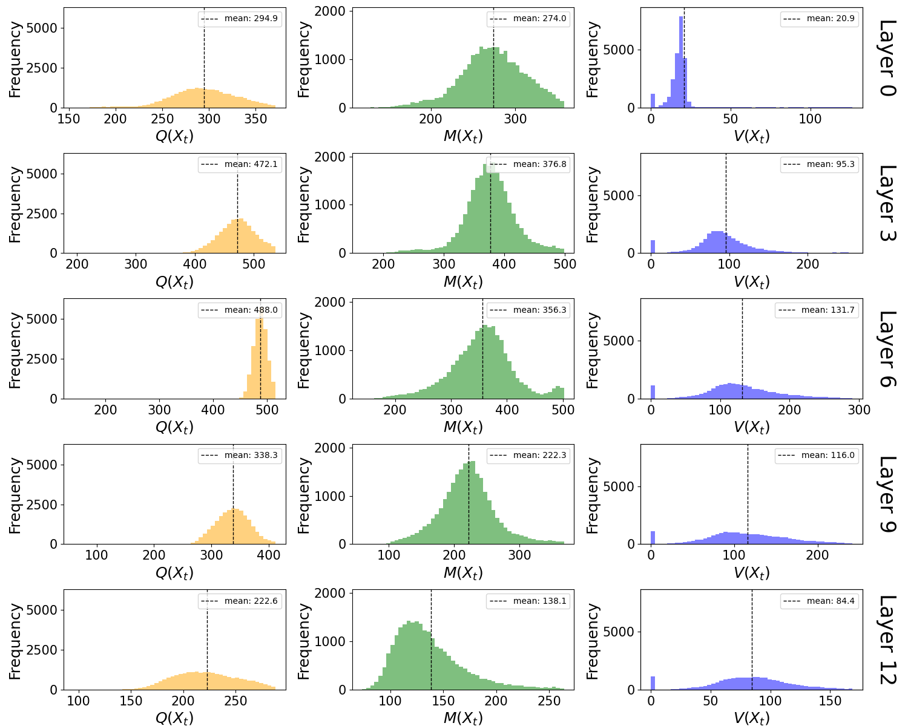
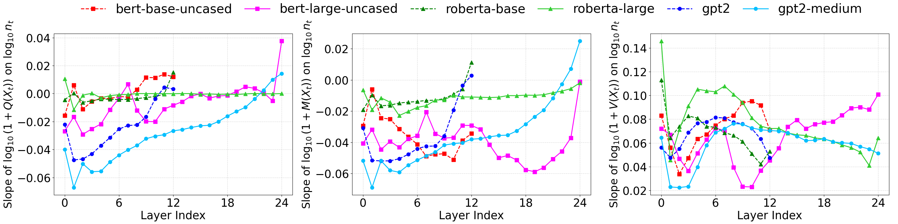
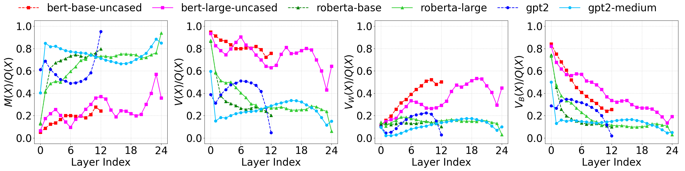
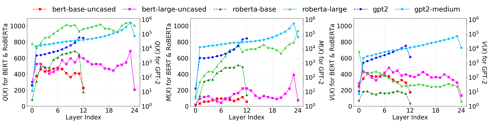
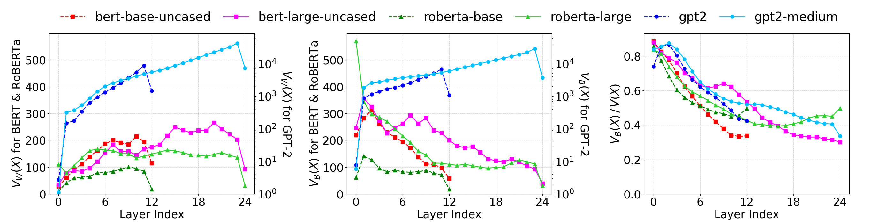
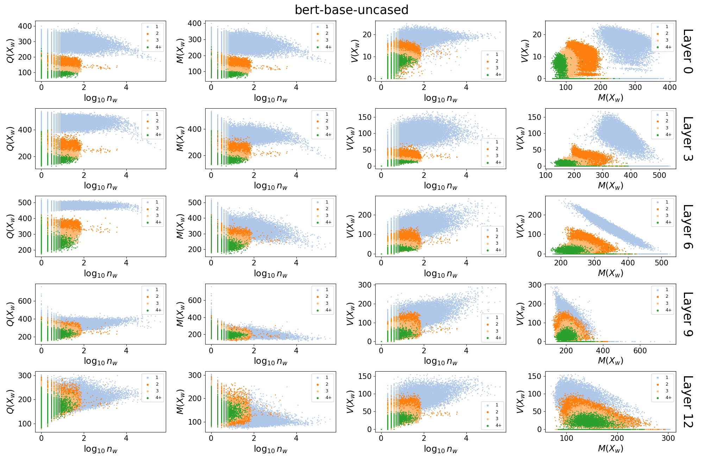

# Appendix

## Code

### Fig. 8 and Table 2 for PCA-trnasformed embeddings in Fig. 1

Fig. 1 generation also produces Fig. 8 and Table 2.

```bash
python src/Fig1_make_pca_scatterplot.py
```

🚨 There was a typo in the definition of $N_r$ in Appendix A:

Correct: $N_r := 2 + \left\lfloor 4\sqrt{\frac{|T_r|}{\max_r{|T_r|}}} \right\rfloor$

Typo (in the paper): $N_r := 2 + \left\lfloor \sqrt{\frac{4|T_r|}{\max_r{|T_r|}}} \right\rfloor$

### Sentence length histogram in Fig. 9

```bash
python src/Appendix_Fig9_make_sentences_histogram.py
```

<div align="center">

</div>

### Histogram of $\textrm{log}_{10} n_t$ in Fig. 10

```bash
python src/Appendix_Fig10_make_tokens_histogram.py 
```

<div align="center">

</div>

### Scatter plots in Figs. 11, 12, and 13

```bash
python src/Appendix_Fig11to13_make_QXt_MXt_VXt_VXtonMXt_scatterplot.py
```

<div align="center">

</div>

### Histograms in Figs. 14, 15, and 16

```bash
python src/Appendix_Fig14to16_make_QXt_MXt_VXt_histogram.py
```

<div align="center">

</div>

### Slope plots in Fig. 17

```bash
python src/Appendix_Fig17_make_Slope_of_QXt_MXt_VXt_plot.py
```

<div align="center">

</div>

### Plots of $M(X)$, $V(X)$, $V_W(X)$, and $V_B(X)$ normalized by Q(X) in Fig. 18

```bash
python src/Appendix_Fig18_make_MX_VX_VwX_VbX_per_QX_plot.py 
```

<div align="center">

</div>

### Plots of $Q(X)$, $M(X)$, and $V(X)$ in Fig. 19

```bash
python src/Appendix_Fig19_make_QX_MX_VX_plot.py
```

<div align="center">

</div>

### Plots of $V_W(X)$, $V_B(X)$, and $V_B(X)/V(X)$ in Fig. 20

```bash
python src/Appendix_Fig20_make_VwX_VbX_VbXperVX_plot.py
```

<div align="center">

</div>

### Appendix J

#### Setup (for reproducibility)

Calculate statistical measures of word embeddings

```bash
python src/Appendix_J_save_word_stats.py
```

Generate the word-to-token count dictionary:

```bash
python src/Appendix_J_save_word2token_count.py
```

#### Setup (download experimental results)

- [bert-base-uncased statistics (Google Drive)](https://drive.google.com/file/d/1IjR1jA-QT8DcfMRHvNYjR1ZNmhkNrAHv/view?usp=drive_link)

- [word-to-token count dictionary (Google Drive)](https://drive.google.com/file/d/1_dod0Bl43_3Ac62Mmnnaf5DoVjnd8Nq9/view?usp=drive_link)

Place the downloaded data in the following structure:

```bash
output/
└── word_stats
    └── bookcorpus_train_lt64_pct001_seed0
        ├── bert-base-uncased.pkl
        └── bookcorpus_bert-base-uncased_word2token_count.pkl
```

Plot Fig. 22:

```bash
python src/Appendix_Fig22_make_QXw_MXw_VXw_VXwonMXw_scatterplot.py 
```

<div align="center">

</div>

🚨 A bug was fixed, and the dots are now plotted in the order of 1, 2, 3, and 4+. As a result, the figure differs slightly from the one in the paper.