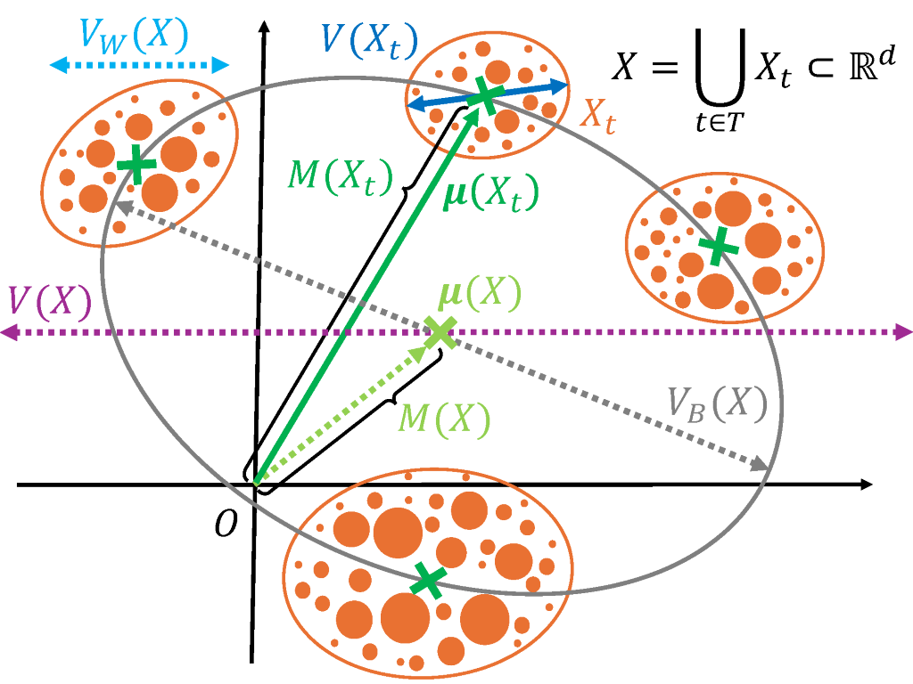

# Norm-and-Variance

> [Norm of Mean Contextualized Embeddings Determines their Variance](https://arxiv.org/abs/2409.11253)                 
> [Hiroaki Yamagiwa](https://ymgw55.github.io/), [Hidetoshi Shimodaira](http://stat.sys.i.kyoto-u.ac.jp/members/shimo/)          
> *Preprint*



# Code
The source code is being organized and will be available soon. 


# Citation
If you find our code useful in your research, please cite our paper:
```
@misc{yamagiwa2024normmeancontextualizedembeddings,
      title={Norm of Mean Contextualized Embeddings Determines their Variance}, 
      author={Hiroaki Yamagiwa and Hidetoshi Shimodaira},
      year={2024},
      eprint={2409.11253},
      archivePrefix={arXiv},
      primaryClass={cs.CL},
      url={https://arxiv.org/abs/2409.11253}, 
}
```