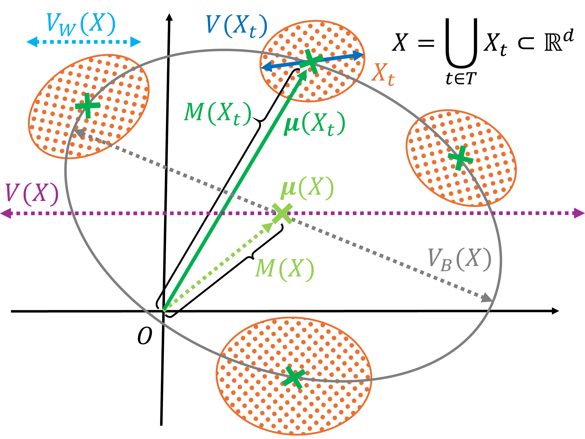
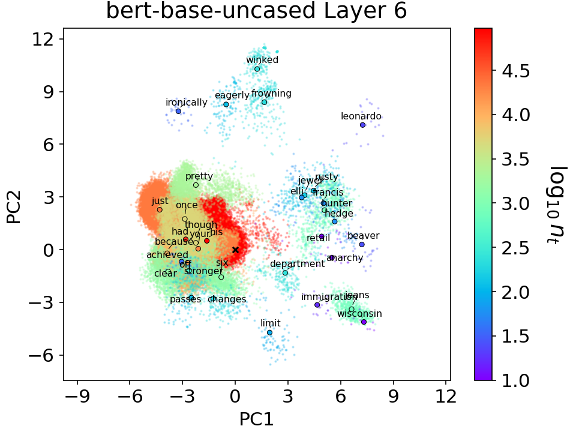
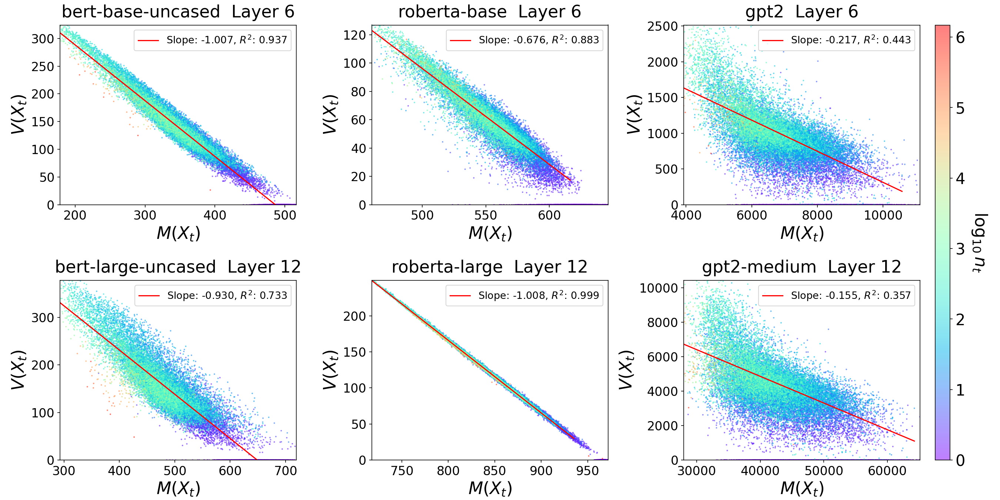
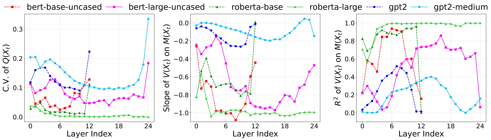
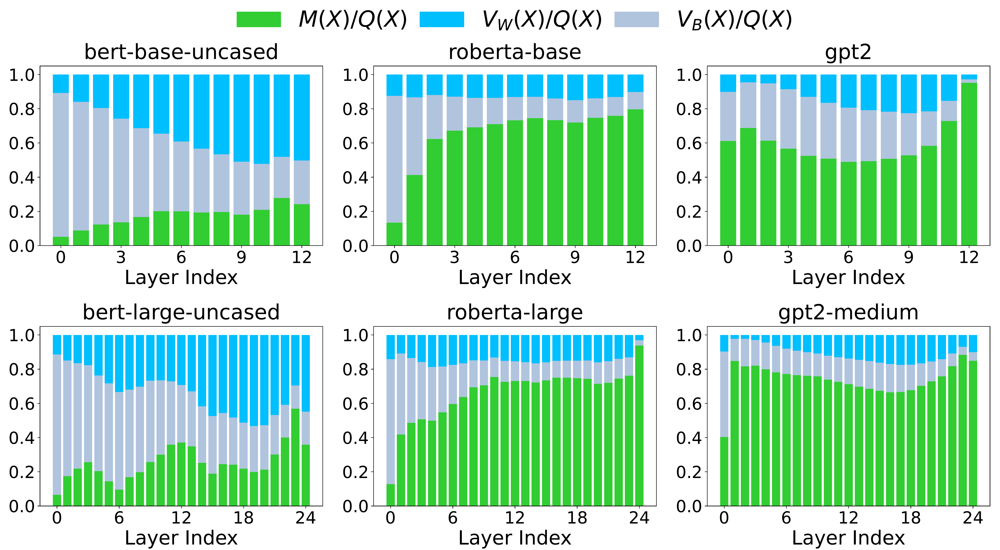
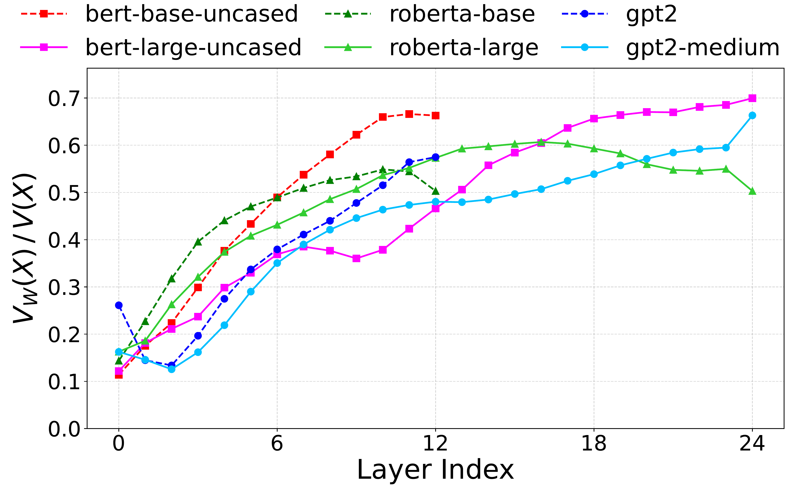
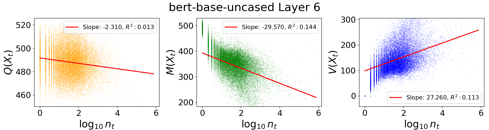

# Norm-and-Variance

> [Norm of Mean Contextualized Embeddings Determines their Variance](https://aclanthology.org/2025.coling-main.521/)                 
> [Hiroaki Yamagiwa](https://ymgw55.github.io/), [Hidetoshi Shimodaira](http://stat.sys.i.kyoto-u.ac.jp/members/shimo/)          
> *COLING 2025*

<div align="center">

</div>

## Setup

This repository is intended to be run in a Docker environment. If you are not familiar with Docker, please install the packages listed in [requirements.txt](requirements.txt).

### Docker build

Create a Docker image as follows:

```bash
$ bash script/docker/build.sh
```

### Environment variable

Set the `DOCKER_HOME` environment variable to specify the path of the directory to be mounted as the home directory inside the Docker container.
```bash
$ export DOCKER_HOME="path/to/your/docker_home"
```

### Docker run
Run the Docker container by passing the GPU ID as an argument:
```bash
$ bash script/docker/run.sh 0
```

## Code

### Saving statistical measures of $X_t$

#### Using preprocessed data from the experiments

- [Sentences extracted from bookcorpus (Google Drive)](https://drive.google.com/file/d/1Ety83AiSanikRsDDe_JtV189UUsXKRIk/view?usp=drive_link)
- [Statistical measures for each model (Google Drive)](https://drive.google.com/drive/folders/1nVX4eNE2T8TlMg7olmJjElcICZFoo56c?usp=drive_link)

Place the downloaded data in the following structure:

```bash
output/
├── datasets
│   └── bookcorpus_train_lt64_pct001_seed0.pkl
└── token_stats
    └── bookcorpus_train_lt64_pct001_seed0
        ├── bert-base-uncased.pkl
        ├── bert-large-uncased.pkl
        ├── gpt2-medium.pkl
        ├── gpt2.pkl
        ├── roberta-base.pkl
        └── roberta-large.pkl
```

#### For reproducibility
To regenerate statistical measures:

```bash
$ python src/save_token_stats.py --model_name model_name
```

The `model_name` values supported are `bert-base-uncased`, `bert-large-uncased`, `roberta-base`, `roberta-large`, `gpt2`, `gpt2-medium`.


### PCA plot in Fig. 1

```bash
$ python src/Fig1_make_pca_scatterplot.py
```

<div align="center">

</div>

This script also generates Fig. 8. and Table 2. See [README.Appendix.md](README.Appendix.md)  for more details.

### Trade-off between $M(X_t)$ and $V(X_t)$ in Fig.2

```bash
$ python src/Fig2_make_VXt_on_MXt_scatterplot.py
```

<div align="center">

</div>

🚨 Note: The color bar range in the published figure was incorrect. While the color bar for BERT was shown, the ranges were not unified across models. This issue has been fixed, and its impact is minimal.

### C.V. of $Q(X_t)$, regression slopes of $V (X_t)$ on $M(X_t)$, and the corresponding $R^2$ in Fig4

```bash
$ python src/Fig4_make_QXtCV_MXtVXtSlope_MXtVXtR2_plot.py
```

<div align="center">

</div>

### Bar graphs for $M(X)/Q(X)$, $V_W(X)/Q(X)$, $V_B(X)/Q(X)$ in Fig. 5 

```bash
$ python src/Fig5_make_MXVwXVbX_per_QX_bargraph.py
```

<div align="center">

</div>

###  Plot of $V_W(X)/V(X)$ in Fig.6

```bash
$ python src/Fig6_make_VwX_per_VX_plot.py
```

<div align="center">

</div>

### Scatter plots of $Q(X_t)$, $M(X_t)$, and $V(X_t)$ against $\textrm{log}_{10}n_t$ in Fig.7

```bash
$ python src/Fig7_make_BERTbase_QXt_MXt_VXt_scatterplot.py
```
<div align="center">

</div>

## Reference

The code for generating embeddings was inspired by:

> Wannasuphoprasit et al. [Solving Cosine Similarity Underestimation between High Frequency Words by $\ell_2$ Norm Discounting](https://aclanthology.org/2023.findings-acl.550/). ACL 2023 Findings.
 
We sincerely thank the authors for sharing their [LivNLP/cosine-discounting](https://github.com/LivNLP/cosine-discounting) codebase.

## Citation
If you find our code or model useful in your research, please cite our paper:

```
@inproceedings{yamagiwa-shimodaira-2025-norm,
    title = "Norm of Mean Contextualized Embeddings Determines their Variance",
    author = "Yamagiwa, Hiroaki  and
      Shimodaira, Hidetoshi",
    editor = "Rambow, Owen  and
      Wanner, Leo  and
      Apidianaki, Marianna  and
      Al-Khalifa, Hend  and
      Eugenio, Barbara Di  and
      Schockaert, Steven",
    booktitle = "Proceedings of the 31st International Conference on Computational Linguistics",
    month = jan,
    year = "2025",
    address = "Abu Dhabi, UAE",
    publisher = "Association for Computational Linguistics",
    url = "https://aclanthology.org/2025.coling-main.521/",
    pages = "7778--7808",
    abstract = "Contextualized embeddings vary by context, even for the same token, and form a distribution in the embedding space. To analyze this distribution, we focus on the norm of the mean embedding and the variance of the embeddings. In this study, we first demonstrate that these values follow the well-known formula for variance in statistics and provide an efficient sequential computation method. Then, by observing embeddings from intermediate layers of several Transformer models, we found a strong trade-off relationship between the norm and the variance: as the mean embedding becomes closer to the origin, the variance increases. Furthermore, when the sets of token embeddings are treated as clusters, we show that the variance of the entire embedding set can theoretically be decomposed into the within-cluster variance and the between-cluster variance. We found experimentally that as the layers of Transformer models deepen, the embeddings move farther from the origin, the between-cluster variance relatively decreases, and the within-cluster variance relatively increases. These results are consistent with existing studies on the anisotropy of the embedding spaces across layers."
}
```

## Appendix
See [README.Appendix.md](README.Appendix.md) for the experiments in the Appendix.

## Note
- Since the URLs of published datasets may change, please refer to the GitHub repository URL instead of the direct URL when referencing in papers, etc.
- This directory was created by [Hiroaki Yamagiwa](https://ymgw55.github.io/).